# School_District_Analysis

# Overview 
  In this challange we are tasked with helping Maria figure out student funding and standarizied testing based on the schools in her district. However due to some dishonety in standarized testing we have to look at the data again and try figure out as to what happened and which school was effected by this. 

## Results 
### How is the district summary affected?
When we compare the data between the original district summary and the new ditrict summary we can tell that average math scores and average reading scores stayed very close. 

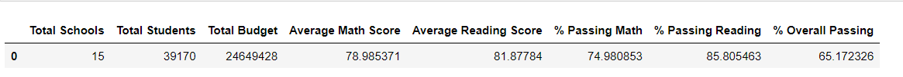

In the updated version there was a slight drop in percenteage but that is due to removing the 9th graders from the data. 

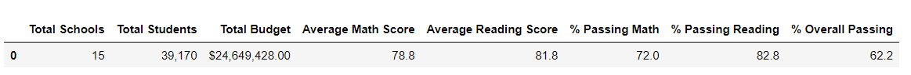

### How is the school summary affected?
By looking at the original school summary we can see that lower schools had much higher math and reading percentages. 

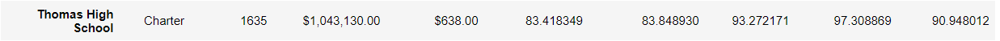

After we updated the data we can see that Wilson High School and Wright High Schools both had a signicant percentage drop in both math and reading. 

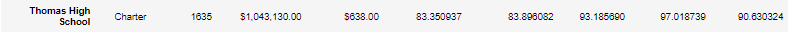

### How does replacing the ninth graders’ math and reading scores affect Thomas High School’s performance relative to the other schools?
Thomas High School scores did not see much of a drop after removing the 9th graders from the data. The drop was so small that it hardly made a diffrence between the two types of data. 

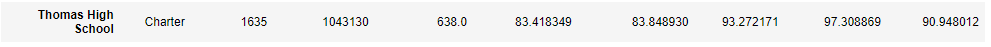

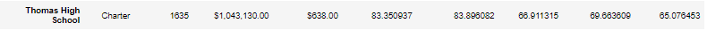

## How does replacing the ninth-grade scores affect the following:

### Math and reading scores by grade
In the original data we can see that the 9th grade scores were part of the complete count of our data that was collected. 

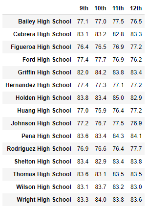

With our updated data we used the NaN function to remove the 9th grade scores due to dishonesty that happened during the testing. 

### Scores by school spending
When we look at the scores by spending we can tell that there was no change between the original spending data and the updated data when it comes to Thomas High School. 

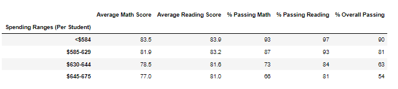

They are identical even with us removing the 9th graders it made no impact on the percentage or the average math and reading scores. 

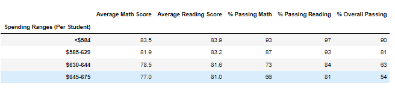

### Scores by school size
As we start to compare Thomas High School's score to the other 4 schools that fall under the same school size we start to see that the scores are very close to each other. Cabreara High School has the highest scores and is cheapest to operate per student cost. 

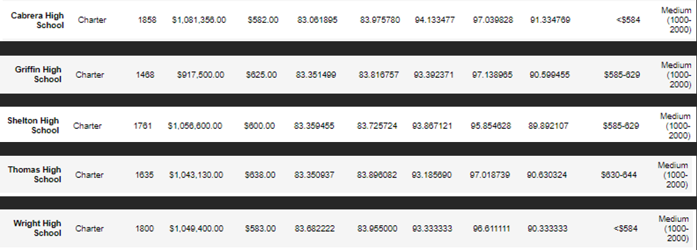

### Scores by school type
By compamring Charter and District schools we can see that Charter schools have a much higher reading and math scores. When comparing their percentage thats where we see the biggest advantege in Charter schools over the District schools. 

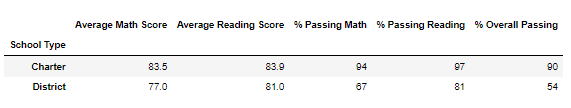

# Summary 
In this analysis we can see that by removing the ninth graders from the Thomas High School that it made some difference in the average reading scores, math scores and the percentage. However the change is very minimum when you compare it to other schools of this size.  

