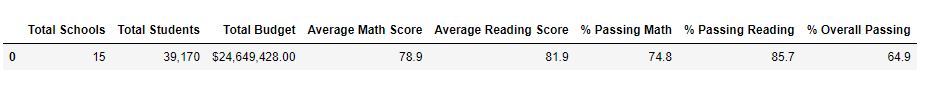

# School_District_Analysis

# Overview 
  In this challange we are tasked with helping Maria figure out student funding and standarizied testing based on the schools in her district. However due to some dishonety in standarized testing we have to look at the data again and try figure out as to what happened and which school was effected by this. 

## Results 
### How is the district summary affected?
When we compare the data between the original district summary and the new ditrict summary we can tell that average math scores and average reading scores stayed very close. 

In the updated version there was a slight drop in percenteage but that is due to removing the 9th graders from the data. 

### How is the school summary affected?
By looking at the original school summary we can see that lower schools had much higher math and reading percentages. 

After we updated the data we can see that Wilson High School and Wright High Schools both had a signicant percentage drop in both math and reading. 

### How does replacing the ninth graders’ math and reading scores affect Thomas High School’s performance relative to the other schools?
Thomas High School scores did not see much of a drop after removing the 9th graders from the data. The drop was so small that it hardly made a diffrence between the two types of data. 

## How does replacing the ninth-grade scores affect the following:

### Math and reading scores by grade
In the original dat awe can see that the 9th grade scores were part of the complete count of our data that was collected. 
 , 

With our updated data we had to remove the 9th graders from out lower 3 schools due to dishonesty and not enough data to be able to provide  

### Scores by school spending

### Scores by school size

### Scores by school type

# Summary 